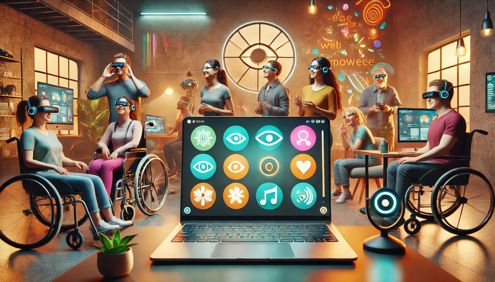
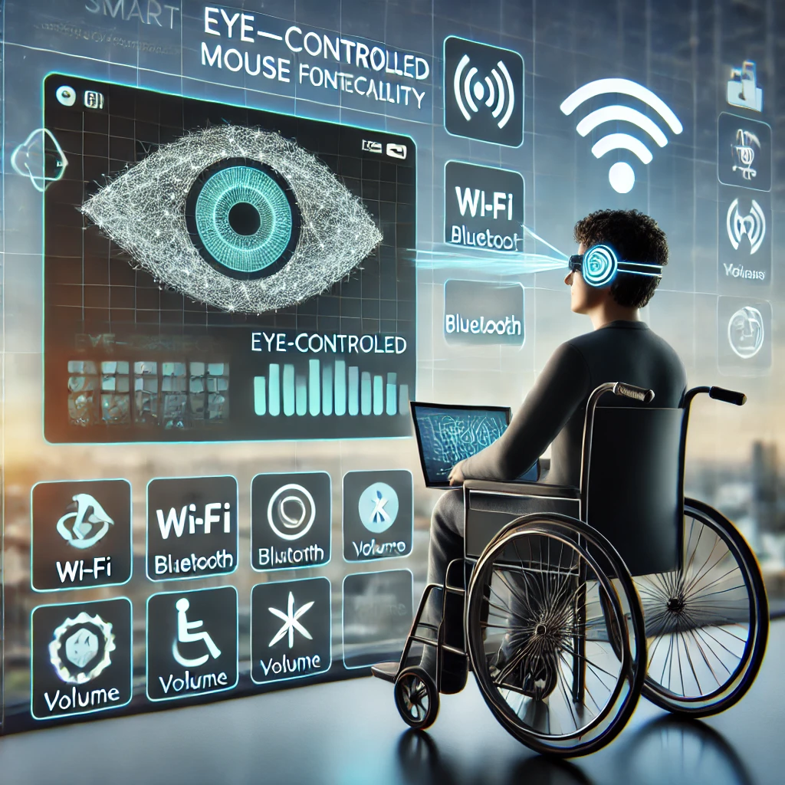

# Mpowerr Smart System for Disabilities 💻✨

The **Mpowerr Smart System** is a groundbreaking assistant designed to help individuals with disabilities use laptops effortlessly. This Python-based system offers accessibility through voice commands, eye tracking, and more. 🌟

---

## 🌍 Inclusivity and Accessibility

### 🦽🦾 **Physical Disabilities**:
The system is built to help individuals with mobility issues. Features like **eye control** allow users to control their laptop without needing to use their hands.

### 👀❌ **Visual Impairment**:
With the **screen reader** feature, the system reads out the content on the screen, ensuring that users with visual impairments can interact with their computer efficiently.

### 👂❌ **Hearing Impairment**:
The system includes visual feedback and text-based interactions, enabling users with hearing impairments to operate the laptop through **voice-to-text** or by controlling features through **eye tracking**.

### 🗣️❌ **Speech Impairment**:
The system supports **eye-controlled typing**, so users with speech impairments can interact with the system by typing without the need for verbal commands.

### 🧠💭 **Cognitive Disabilities**:
The **simple interface** and **speech synthesis** functionalities are designed to aid individuals with cognitive disabilities. The system's commands are straightforward, and the **audio feedback** helps users understand the task at hand.

### 📚🚶‍♂️ **Learning Disabilities**:
The system aids users with learning disabilities by using **text-to-speech** and providing intuitive navigation through **voice commands**.

### 🤲🦵 **Motor Impairment**:
Individuals with limited or no motor function can control the system using **eye movements** and **voice commands**, eliminating the need for a keyboard or mouse.

### 🧠⚡ **Neurological Disorders**:
For users with neurological conditions, the system’s **speech recognition** and **emotion detection** features ensure a smooth and responsive interaction with the laptop, adapting to different needs.

---


## ✨ Features:

- 👁️ **Mouse Control by Eyes**

- 🎤 **Voice-Controlled Typing**

- 📶 **Bluetooth Connection by Voice**

- 🌐 **Wi-Fi Connection by Voice**

- 🔊 **Volume Control by Voice** (Increase/Decrease)

- 🖼️ **Change Desktop Wallpaper by Voice**

- 📂 **Rename Folder and Create Files**

- ⏹️ **Shut Down PC**

- ⚙️ **Open System Settings**:
  - Bluetooth Settings
  - Control Panel
  - Camera
  - Folders and Files

- 🌍 **Open Popular Websites**:
  - Gmail 📧
  - Google 🌍
  - YouTube 🎥
  - Facebook 👥

- 🗣️ **Screen Reader**
- ✍️ **Type with Eyes**
- 🎶 **Play Songs**
- 🌐 **Translate Languages**
- 😊 **Detect Emotion and Provide Motivational 
Messages**
- 📸 **Capture Photos**
- 🕒 **Check Time and Date**
- 📋 **Daily Planner**

---

## ⚙️ How It Works:

- **Eye-Controlled Mouse** 👁️:
  Tracks eye movement using `MediaPipe` to control the cursor.
  
- **Voice Commands** 🎤:
  Use voice commands to perform tasks like connecting to Wi-Fi, opening websites, and adjusting volume.

- **Emotion Detection** 😊:
  Analyzes emotions with `DeepFace` and provides motivational messages.

- **Language Translation** 🌐:
  Translate text between multiple languages using `googletrans`.

- **Daily Planner** 📋:
  Helps plan and organize daily tasks efficiently.

---

## 🧑‍💻 Technologies Used:

### Programming Language:
- Python 🐍

---

### Libraries Used:

- `cv2` (OpenCV) - Image and video processing

- `mediapipe` - Eye and face tracking

- `pyautogui` - Mouse and keyboard automation

- `speech_recognition` - Voice command recognition

- `pyttsx3` - Text-to-speech conversion

- `deepface` - Emotion detection

- `googletrans` - Language translation

- `datetime`, `os`, `subprocess` - System utilities

---

## 📷 Demo:





---

## Setting Up the Python Program:

### 📚 Libraries and Tools:

- `opencv-python` (`cv2`) - Image and video processing.

- `mediapipe` - Facial and eye landmark detection.

- `pyautogui` - For simulating mouse and keyboard actions.

- `speech_recognition` - For voice command recognition.

- `pyttsx3` - Converts text to speech for screen reading.

- `deepface` - Emotion detection from facial expressions.

- `googletrans` - Translate text into different languages.

- Built-in Python modules like `os`, `datetime`, and `subprocess`.

---

### 📚 Required Python Libraries:

Ensure the following libraries are installed before running the program:

- OpenCV (`cv2`)

- MediaPipe

- PyAutoGUI

- SpeechRecognition

- pyttsx3

- DeepFace

- googletrans

- DateTime

- Os

- Random

- Threading

- System

- Webbrowser

- Subprocess

---

### 📦 Install the required libraries using pip:

Run the following command in your terminal:


1. ```pip install speechrecognition```

2. ```pip install opencv-python```

3. ```pip install mediapipe ```

4. ```pip install time ```

5. ```pip install pyttsx3```

6. ```pip install deepface```

7. ```pip install pyautogui```

8. ```pip install datetime```

9. ```pip install threading```

10. ```pip install random```

11. ```pip install sys```

12. ```pip install webbrowser```

13. ```pip install os```

14. ```pip install googletrans```

15. ```pip install subprocess```

---

## 🚀 Getting Started:

### 📚 Prerequisites:

Ensure your system meets the following requirements:

- Python 3.8 or higher 🐍

- A webcam for facial tracking 🎥

- Microphone for voice commands 🎤

---

## 📞 Contact

- [Website](https://mpowerr.com/)